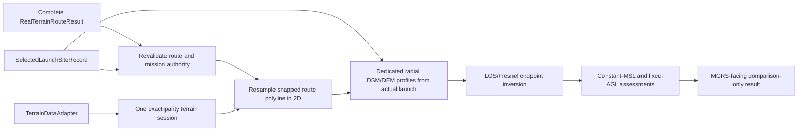

# Real-Terrain Minimum-Altitude Analysis Boundary

## Purpose

Task 036A proposes, but does not implement, the future real-terrain
minimum-required-altitude analysis boundary. The future feature is an offline
DSM/LOS/Fresnel clearance proxy for reviewed route candidates. It is not obstacle
clearance certification, flight-safety approval, communication-success evidence,
regulatory approval, airspace authorization, or an autopilot command.

The existing `minimum_altitude.py` remains the backward-compatible synthetic
single-profile scaffold. This document does not change its API or claim that its
single endpoint inversion is already a real-terrain route implementation.

## Selected Architecture

The proposed architecture is **F: complete route authority plus authoritative actual
launch record, exact-parity terrain session, and dedicated altitude profiles**. A
future public entry point is:

```python
def analyze_real_terrain_minimum_altitude(
    route_result: RealTerrainRouteResult,
    selected_launch_site: SelectedLaunchSiteRecord,
    *,
    terrain_adapter: TerrainDataAdapter,
    config: RealTerrainMinimumAltitudeConfig,
    projected_to_mgrs: ProjectedToMgrsConverter,
) -> RealTerrainMinimumAltitudeResult: ...
```

`RealTerrainRouteResult` is the immutable authority for route candidates and source
order, reviewed 3D route totals, mission frequency, current fixed AGL, terrain
metadata, snapped route endpoints, actual selected-point ground MSL, and snap
distances. `SelectedLaunchSiteRecord` is separately authoritative for the actual
selected launch projected point and MGRS. It must satisfy all of the following before
a terrain session starts:

- `selected_launch_site.candidate_id == route_result.selected_candidate_id`;
- `selected_launch_site.launch_site_mgrs == route_result.launch_site_mgrs`; and
- conversion of the selected projected point exactly equals `launch_site_mgrs`.

The selected projected point, not the snapped graph node, is the radial-profile
origin. The route result's `launch_ground_msl_m` is the DEM sampled at that actual
selected point. It must never be described as snapped-node ground MSL.



`RealTerrainWaypointResult` remains report-oriented and must not supply
clearance-profile samples.

## Alternatives Considered

| Alternative | Input authority | Reason rejected or selected |
|---|---|---|
| A. Complete route result only | Route result and existing handoffs | Rejected alone: handoffs are route vertices, not dense DSM/DEM clearance profiles. |
| B. Waypoint result | Approximate 500 m report records | Rejected: reporting interpolation is not terrain-clearance evidence. |
| C. Route handoff only | Per-route handoff tuples | Rejected: drops mission, metadata, snap, and selected-point authority. |
| D. Separate profile only | Newly sampled terrain profile | Rejected alone: cannot prove parity with reviewed routes, frequency, or AGL. |
| E. Route authority plus dedicated profiles | Complete result plus one session | Rejected: leaves actual selected launch versus snapped-node origin ambiguous. |
| F. Route authority plus actual launch record and dedicated profiles | Complete result, selected record, one exact-parity session | Proposed: preserves route authority and actual-launch parity while sampling required clearance evidence. |

A snapped-only origin was rejected. It would require a separately sampled
`snapped_launch_ground_msl_m` and would change parity with the current Task 035EF
node LOS/Fresnel origin. Reusing actual-point ground MSL with a snapped-point radial
origin is prohibited.

## Authoritative Inputs and Terrain-Session Parity

Before opening or sampling the one required terrain session, the future analyzer must
re-run the complete route-result validator and require:

- one or more route candidates and handoffs in existing `RouteMode` order;
- candidate, handoff, snapped endpoint, MGRS, source 3D total, and selected-record
  parity;
- finite `route_result.launch_ground_msl_m`, positive source frequency, and positive
  current allowed AGL;
- a public-safe scenario label and a callable MGRS converter; and
- a session metadata exact-policy match with `route_result.terrain_metadata`.

Compatible geometry is insufficient. The exact policy covers dataset label or
identifier, DEM and DSM metadata, CRS, bounds, width and height, resolution, NoData
semantics, vertical datum or convention, represented source/provider/license terms,
processing summary/version/date fields, and redistribution or synthetic flags where
present. A future implementation must use stable authoritative dataclass equality when
available, otherwise an explicit equality helper over this field list. A mismatch is
fatal before sampling with:

```text
terrain session metadata does not match source route terrain authority
```

The sole frequency authority is `route_result.config.frequency_hz`. A future config
may carry `expected_frequency_hz=None` to inherit it or a finite positive value that
must match it exactly; a mismatch is fatal.

## Altitude and Distance Terms

| Term | Frozen meaning |
|---|---|
| `actual_launch_ground_msl_m` | `route_result.launch_ground_msl_m`: DEM MSL sampled at the actual selected launch point. |
| `launch_antenna_msl_m` | `actual_launch_ground_msl_m + route_result.config.allowed_flight_agl_m`; fixed actual-launch line endpoint. |
| Actual radial-profile origin | `selected_launch_site.projected_point`. |
| Snapped route origin | First graph point of each route candidate; it can differ from the actual launch point by `launch_snap_distance_m`. |
| Actual-to-snapped connector | The radial profile from the actual selected point to the first snapped route sample; it is evaluated before the remaining route samples. |
| `source_total_distance_3d_m` | Reviewed source candidate total used only for source identity and parity. |
| `route_polyline_total_distance_2d_m` | Horizontal sum of snapped route-polyline segments used for target resampling. |
| `cumulative_route_distance_2d_m` | Horizontal route-sample location used for ordering, spacing, guards, and ties. |
| `radial_distance_2d_m` | Horizontal distance from actual selected origin to a radial endpoint or radial profile sample. |

`profile_spacing_m` operates only on horizontal 2D distance. Route-sample guards use
the 2D route estimate; per-link and aggregate profile guards use radial 2D estimates.
The source 3D total is never compared to a resampled 2D total. Both totals are
retained and validated independently, and future schema names use `_2d_m` or `_3d_m`.

## Dedicated Profile Sampling and Constant-MSL Requirement

For each source candidate, resample its snapped-graph polyline in increasing
`cumulative_route_distance_2d_m` at resolved positive spacing. Include each snapped
route endpoint once. For every route sample, including the first snapped sample,
extract a bounded radial DEM/DSM profile from the actual selected projected point to
that sample through the same exact-parity terrain session. This evaluates the
actual-to-snapped connector rather than silently skipping it.

The resolved spacing is `config.profile_spacing_m` when provided; otherwise it is
`route_result.config.profile_spacing_m`. An explicit spacing must be positive and no
larger than the source route profile spacing. For a coincident actual and snapped
origin, the implementation validates endpoint occupancy without creating an invalid
zero-length inversion profile.

For route sample `j`, let `A` be launch antenna MSL. For each eligible radial profile
sample `i` with path ratio `t_i > epsilon`, DSM MSL `D_i`, first Fresnel radius `r_i`,
and configured clearance ratio `q`, compute:

```text
required_endpoint_msl_j = max(
    A + (D_i + q * r_i - A) / t_i
    for eligible radial samples i on link j
)

minimum_required_constant_route_msl_m = max(
    required_endpoint_msl_j for all route samples j
)
```

`r = 0` at a radial endpoint is valid and contributes LOS-only DSM clearance. The
actual launch endpoint has `t = 0` and is excluded from inversion; its DSM must be at
or below `launch_antenna_msl_m`. Every route sample is a radial endpoint and is
eligible. A snapped target endpoint may therefore be a constant-MSL limiting sample.

The constant-MSL limiting sample is the `argmax(required_endpoint_msl_j)`. Values
within `1e-9` m are tied, then choose lower `cumulative_route_distance_2d_m`, lower
route-sample index, lower radial-profile sample index, and lower source route order.
This selection is independent of the current fixed-AGL deficit-limiting sample.

## Fresnel Policy

- `required_fresnel_clearance_ratio` defaults to `0.6` as a proxy default, not a
  measured link-performance threshold.
- The future config permits an explicit finite ratio in `[0.0, 1.0]`.
- `0.0` means DSM LOS-only clearance for this proxy; it does not guarantee
  communication.
- Invalid, non-finite, or negative radius values are fatal.

## Current Fixed-AGL Baseline Assessment

The primary result remains one comparison-only constant MSL per source route. A
separate fixed-AGL baseline assessment evaluates every route sample; it must not infer
sufficiency from only the constant-MSL limiting sample. For every route sample `j`:

```text
current_route_flight_msl_j = local_dem_msl_j + allowed_flight_agl_m
current_clearance_margin_m_j = current_route_flight_msl_j - required_endpoint_msl_j
```

Then:

```text
minimum_current_clearance_margin_m = min(current_clearance_margin_m_j)
current_fixed_agl_meets_proxy = minimum_current_clearance_margin_m >= -tolerance
```

The current-AGL deficit-limiting sample is the `argmin(current_clearance_margin_m_j)`.
Ties use lower `cumulative_route_distance_2d_m`, lower route-sample index, and lower
source route order; the associated radial-profile provenance remains available for
diagnostics. It is distinct from the constant-MSL limiting sample and can identify a
different point.

## Nonnegative AGL Conversions

With `H` equal to the highest route-sample DEM MSL and `T` equal to the snapped target
route-sample DEM MSL:

```text
agl_over_highest_route_dem_m = minimum_required_constant_route_msl_m - H
agl_over_target_dem_m = minimum_required_constant_route_msl_m - T
```

Every route sample is a radial endpoint, so `t = 1` and `r = 0` there. Thus its
requirement is at least local DSM and local DSM is at least local DEM. The route-level
maximum is therefore at least both `H` and `T`. Required invariants are:

```text
agl_over_highest_route_dem_m >= -tolerance
agl_over_target_dem_m >= -tolerance
```

Values within tolerance of zero normalize to `0.0`. The future result exposes only
these nonnegative AGL values: there is no negative raw-AGL state, display clamp, or
negative-AGL warning.

## Future Immutable Result Contract

`RealTerrainMinimumAltitudeConfig` retains:

```text
expected_frequency_hz: float | None
required_fresnel_clearance_ratio: float = 0.6
profile_spacing_m: float | None
epsilon_m: float = 1e-9
max_route_samples: int = 10_000
max_profile_samples_per_link: int = 10_000
max_total_profile_samples: int = 50_000
```

`RealTerrainRouteAltitudeSample` retains route ID/mode, route-sample MGRS and index,
`cumulative_route_distance_2d_m`, local DEM/DSM, current route flight MSL,
`required_endpoint_msl_m`, `current_clearance_margin_m`, radial-profile sample count,
and its constant-MSL limiting radial sample. Private projected/profile provenance is
retained for validation and must validate finite values, `DSM >= DEM`, selected-record
parity, and source-route parity.

`RealTerrainRouteMinimumAltitudeResult` retains source route ID/mode/order,
`source_total_distance_3d_m`, `route_polyline_total_distance_2d_m`, resolved
frequency/ratio/spacing, actual selected launch authority, launch antenna MSL, minimum
constant-route MSL, highest and target DEM, nonnegative AGL conversions,
constant-MSL limiting sample, `minimum_current_clearance_margin_m`,
`current_fixed_agl_meets_proxy`, current-AGL deficit-limiting sample, warnings,
terrain provenance, and ordered route samples.

The top-level result retains selected candidate ID/MGRS/private projected authority,
source route IDs/modes/order/3D totals, exact terrain-metadata authority,
config/frequency, ordered route results, and summary/warning parity. Default public
output remains MGRS-facing and omits projected points, WGS84 geometry, raster indices,
raw profile cells, and private local paths.

## Resource Guards, Failure, and Warning Policy

Before profile extraction, estimate route 2D sample counts and radial profile sample
counts from the actual selected launch point. Enforce per-route route-sample,
per-link radial-profile, and global radial-profile limits in this order:

```text
route-sample guard
then aggregate radial preflight guard
then first extract_profile call
```

The complexity boundary is `O(route samples + total radial profile samples)`. Resource
guard, authority, metadata, missing profile, raster extent/NoData, non-finite value,
`DSM < DEM`, endpoint occupancy, MGRS conversion, and cross-object invariant failures
are fatal and return no partial result.

Future warning strings are frozen in this order per source route:

```text
{route_id}: current fixed-AGL route is below the configured clearance proxy at one or more route samples.
{route_id}: constant-MSL limiting sample is the snapped target endpoint.
{route_id}: current-AGL deficit-limiting sample is the snapped target endpoint.
{route_id}: requested source-zone metadata is unavailable.
```

Only applicable strings are emitted in this order; result and summary warning parity
is mandatory. The current MVP does not request route source-zone data and retains
`NOT_REQUESTED`; the final warning is reserved for a separately reviewed provider
contract.

## Compatibility, Limits, and Follow-up

Task 036A does not alter `minimum_altitude.py`, route/waypoint source, LOS/Fresnel,
scoring, classification, preview/CLI, workflows, dependencies, or data policy. It
does not add GIS data, generated artifacts, private paths, operational coordinates,
route selection, device control, or autopilot behavior.

The next implementation task must add a separate real-terrain altitude module and
TDD coverage for selected-launch authority, exact metadata parity, 2D/3D distance
semantics, profile bounds, inversion, ratio endpoints, resource guards, independent
limiting samples, nonnegative AGL invariants, warning order, MGRS output, and
public-coordinate omission before any runtime behavior is claimed.
