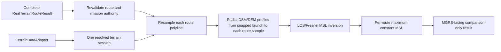

# Real-Terrain Minimum-Altitude Analysis Boundary

## Purpose

Task 036A defines, but does not implement, the future real-terrain
minimum-required-altitude analysis boundary. The future feature is an offline
DSM/LOS/Fresnel clearance proxy for reviewed route candidates. It is not obstacle
clearance certification, flight-safety approval, communication-success evidence,
regulatory approval, airspace authorization, or an autopilot command.

The existing `minimum_altitude.py` remains the backward-compatible synthetic
single-profile scaffold. This document does not change its API or claim that its
single endpoint inversion is already a real-terrain route implementation.

## Selected Architecture

The selected architecture is **E: complete route authority plus dedicated altitude
profiles**. A future public entry point is:

```python
def analyze_real_terrain_minimum_altitude(
    route_result: RealTerrainRouteResult,
    *,
    terrain_adapter: TerrainDataAdapter,
    config: RealTerrainMinimumAltitudeConfig,
    projected_to_mgrs: ProjectedToMgrsConverter,
) -> RealTerrainMinimumAltitudeResult: ...
```

`RealTerrainRouteResult` is the immutable authority for mission frequency, current
allowed AGL, route order, route totals, snapped endpoints, terrain metadata, launch
ground, and public MGRS identifiers. The future implementation revalidates that
result, opens exactly one terrain session, and builds new bounded DEM/DSM profiles.
It must not use `RealTerrainWaypointResult` values as clearance-profile samples.



## Alternatives Considered

| Alternative | Input authority | Reason rejected or selected |
|---|---|---|
| A. Complete route result only | Route result and existing handoffs | Rejected alone: handoffs are route vertices, not a dense DSM/DEM clearance profile. |
| B. Waypoint result | Approximate 500 m report records | Rejected: report interpolation is intentionally display-oriented and may be sparse or conservative for color/score rather than terrain clearance. |
| C. Route handoff only | Per-route handoff tuples | Rejected: drops mission, metadata, snap, route-order, and public-output authority. |
| D. Separate profile only | Newly sampled terrain profile | Rejected alone: cannot prove parity with the reviewed route candidates, frequency, AGL, or route order. |
| E. Route authority plus dedicated profiles | Complete result plus one terrain session | Selected: preserves reviewed authority while sampling the DSM/DEM evidence needed for a clearance proxy. |

## Authoritative Inputs and Validation

The future analyzer accepts only a complete `RealTerrainRouteResult`, a
`TerrainDataAdapter`, a config, and a MGRS converter. Before a terrain session starts
it must re-run the route-result validator and require:

- one or more route candidates and handoffs in the existing `RouteMode` order;
- candidate, handoff, snapped endpoint, MGRS, total-distance, and terrain-metadata
  parity;
- finite `launch_ground_msl_m`, positive source frequency, and positive current
  allowed AGL;
- supported aligned DEM/DSM metadata with EPSG:5179, common bounds, compatible
  resolution/dimensions, and a documented MSL vertical convention;
- config frequency, if explicitly supplied, equal to the source route frequency;
- a public-safe scenario label and a callable MGRS converter.

The sole current frequency authority is `route_result.config.frequency_hz`. A future
config may carry `expected_frequency_hz=None` to inherit it or a finite positive
value that must match it exactly; a mismatch is fatal.

## Altitude Terms and Primary Semantics

| Term | Frozen meaning |
|---|---|
| `launch_ground_msl_m` | DEM MSL at the snapped launch node, retained by the route result. |
| `launch_antenna_msl_m` | `launch_ground_msl_m + route_result.config.allowed_flight_agl_m`; the fixed launch-side line endpoint for this proxy. |
| Current allowed flight AGL | Existing fixed value `route_result.config.allowed_flight_agl_m`; it is not a newly recommended altitude. |
| Current route flight MSL | At each resampled route point: local DEM MSL plus current allowed AGL. It is a comparison baseline and therefore varies by terrain. |
| Minimum required endpoint MSL | Legacy Task 015 single-profile endpoint result only. It is not the primary real-terrain route output. |
| Minimum required constant-route MSL | The selected primary future result: one MSL that is at least every eligible radial-profile sample requirement for one route candidate. |
| Minimum required per-waypoint MSL | Diagnostic comparison values only; not a recommended flight command. |
| AGL over highest route DEM | Constant-route MSL minus the maximum DEM MSL among route-polyline samples. |
| AGL over target DEM | Constant-route MSL minus DEM MSL at that route's snapped target endpoint. |

The primary MVP computes **one minimum required constant-route MSL per available
route candidate**. It does not produce constant-AGL terrain following, per-segment
commands, a final route choice, or automatic route ranking changes. Per-sample values
exist only to explain the route-level maximum.

## Dedicated Profile Sampling and Inversion

For each source candidate, the future implementation resamples its snapped-graph
polyline in cumulative 2D route distance at a resolved positive profile spacing. It
includes the snapped launch and target once, orders samples by increasing cumulative
route distance, and samples local DEM/DSM at each point.

For every non-launch route sample, it extracts a dedicated radial profile from the
snapped launch projected point to that route sample through the same terrain session.
The resolved spacing is `config.profile_spacing_m` when provided; otherwise it is
`route_result.config.profile_spacing_m`. An explicit spacing must be positive and no
larger than the source route profile spacing. This avoids treating route handoffs or
500 m report interpolation as terrain-clearance evidence.

For every radial-profile sample with path ratio `t > epsilon`, let `A` be launch
antenna MSL, `D` be DSM MSL, `q` be required clearance ratio, and `r` be first
Fresnel radius. The requirement is:

```text
required_clearance_m = q * r
required_los_msl = D + required_clearance_m
required_endpoint_msl = A + (required_los_msl - A) / t
route_constant_msl = max(required_endpoint_msl for all eligible radial samples)
```

`r = 0` at a radial endpoint is valid and contributes LOS-only DSM clearance. The
launch endpoint is excluded from inversion because `t = 0`; its DSM must instead be
at or below `launch_antenna_msl_m`. The snapped target endpoint is eligible, so a
target limiting sample is possible and produces a warning. A launch or target DSM
surface above its current fixed-AGL flight MSL is fatal because the source route's
current endpoint occupancy invariant is broken.

## Fresnel Policy

- Frequency uses the source route authority as above.
- `required_fresnel_clearance_ratio` defaults to `0.6`, preserving the legacy proxy
  default without claiming measured link performance.
- The future config permits an explicit finite ratio in `[0.0, 1.0]`.
- `0.0` is allowed and means DSM LOS-only clearance for this proxy; it does not mean
  communication is guaranteed.
- Radius-zero endpoint samples remain eligible with zero Fresnel margin.
- The launch radial endpoint is excluded from inversion; the target radial endpoint
  is included. Invalid, non-finite, or negative radius values are fatal.

## Limiting Sample and Tie Policy

The limiting sample is the eligible radial-profile sample with the maximum required
endpoint MSL. Requirements within `1e-9` m are tied. Ties select the lower route
cumulative distance, then lower route-sample index, then lower radial-profile sample
index, then lower source route order. This makes the limiting MGRS-facing diagnostic
stable without changing candidate order or route cost.

## MSL-to-AGL Conversions

For each route result, with `H` equal to the highest route-polyline DEM MSL and `T`
equal to the snapped target DEM MSL:

```text
raw_agl_over_highest_route_dem_m = minimum_required_constant_route_msl_m - H
display_agl_over_highest_route_dem_m = max(0, raw_agl_over_highest_route_dem_m)
raw_agl_over_target_dem_m = minimum_required_constant_route_msl_m - T
display_agl_over_target_dem_m = max(0, raw_agl_over_target_dem_m)
```

An optional local diagnostic AGL is `minimum_required_constant_route_msl_m - local
route-sample DEM MSL`; it is not a command. Negative raw AGL is mathematically
possible when the reference route DEM is higher than the route-level requirement.
Display clamping is presentation-only and must not change the raw calculation or
clearance decision.

## Future Immutable Result Contract

`RealTerrainMinimumAltitudeConfig` retains:

```text
expected_frequency_hz: float | None
required_fresnel_clearance_ratio: float = 0.6
profile_spacing_m: float | None
epsilon_m: float = 1e-9
max_route_samples: int = 10_000
max_profile_samples_per_link: int = 10_000
max_total_profile_samples: int = 50_000
```

`RealTerrainAltitudeRequirementSample` retains private projected/profile provenance
for validation plus route ID/mode, route sample index and cumulative distance,
radial-profile sample index, DEM/DSM, Fresnel radius, clearance ratio, required MSL,
and a MGRS-facing limiting-point field. It must validate finite values, `DSM >= DEM`,
and source-route parity.

`RealTerrainRouteMinimumAltitudeResult` retains one source route ID/mode/total, source
sample count, resolved frequency/ratio/spacing, launch ground/antenna MSL, current
allowed AGL, minimum constant-route MSL, highest/target DEM conversions, limiting
sample, warnings, and terrain-profile provenance.

`RealTerrainMinimumAltitudeSummary` retains route count, eligible requirement count,
warning count, and deterministic source-order totals. `RealTerrainMinimumAltitudeResult`
retains ordered route results, the source route ID/mode/order/totals, frequency,
launch ground/antenna MSL, terrain metadata/provenance, and summary. These private
authority fields are required for cross-object validation and are omitted from the
default public dictionary.

Default public output is MGRS-facing: route ID/mode, MGRS launch/target/limiting point,
constant MSL, raw/display AGL conversions, warning text, and interpretation limit. It
must omit projected points, WGS84 geometry, raster indices, raw profile cells, and
private local paths.

## Failure and Warning Policy

Fatal typed errors return no partial result for wrong or incomplete route input,
authority/frequency mismatch, invalid ratio, unresolved or unsupported terrain
metadata, missing profile, raster extent/NoData, non-finite values, `DSM < DEM`,
endpoint occupancy failure, resource guards, MGRS conversion failure, and any
cross-object invariant failure.

Future warning strings are frozen in this order per source route:

```text
{route_id}: required constant-route MSL is below current route flight MSL at limiting route sample.
{route_id}: required constant-route MSL exceeds current route flight MSL at limiting route sample.
{route_id}: raw AGL over highest route DEM is negative; display value is clamped to zero.
{route_id}: raw AGL over target DEM is negative; display value is clamped to zero.
{route_id}: limiting sample is the target endpoint.
{route_id}: requested source-zone metadata is unavailable.
```

Only applicable strings are emitted, in the listed order, and result/summary warning
parity is mandatory. The current MVP does not request route source-zone data and
retains `NOT_REQUESTED`; the final warning is reserved for a separately reviewed
future provider-enabled contract.

## Compatibility, Limits, and Follow-up

Task 036A does not alter `minimum_altitude.py`, route/waypoint source, LOS/Fresnel,
scoring, classification, preview/CLI, workflows, dependencies, or data policy. It
does not add GIS data, generated artifacts, private paths, operational coordinates,
route selection, device control, or autopilot behavior.

The next implementation task must add a separate real-terrain altitude module and
TDD coverage for authority, profile spacing/bounds, inversion, ratio endpoints,
resource guards, MGRS conversion, warning order, and public-output omission before
any runtime behavior is claimed.
